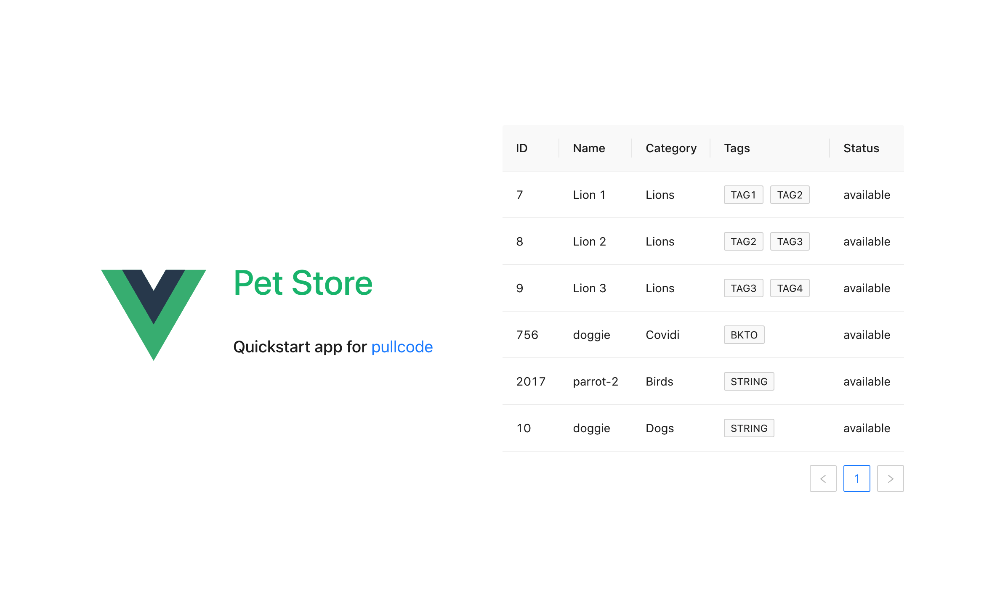

# pullcode

pullcode是基于OpenAPI规范的封装了axios的typescript http请求客户端代码生成器。通过配置npm script命令即可直接将代码生成到指定目录下，直接使用。支持json格式的Swagger 2和OpenAPI 3(aka Swagger 3)文档。  

<!-- START doctoc generated TOC please keep comment here to allow auto update -->
<!-- DON'T EDIT THIS SECTION, INSTEAD RE-RUN doctoc TO UPDATE -->
### TOC

- [特性](#%E7%89%B9%E6%80%A7)
- [感谢](#%E6%84%9F%E8%B0%A2)
- [安装](#%E5%AE%89%E8%A3%85)
- [命令可选项](#%E5%91%BD%E4%BB%A4%E5%8F%AF%E9%80%89%E9%A1%B9)
- [代码生成规则](#%E4%BB%A3%E7%A0%81%E7%94%9F%E6%88%90%E8%A7%84%E5%88%99)
- [用法](#%E7%94%A8%E6%B3%95)
- [快速上手](#%E5%BF%AB%E9%80%9F%E4%B8%8A%E6%89%8B)
- [更多示例代码](#%E6%9B%B4%E5%A4%9A%E7%A4%BA%E4%BE%8B%E4%BB%A3%E7%A0%81)
  - [拦截请求错误](#%E6%8B%A6%E6%88%AA%E8%AF%B7%E6%B1%82%E9%94%99%E8%AF%AF)
  - [请求接口](#%E8%AF%B7%E6%B1%82%E6%8E%A5%E5%8F%A3)
- [姐妹项目](#%E5%A7%90%E5%A6%B9%E9%A1%B9%E7%9B%AE)

<!-- END doctoc generated TOC please keep comment here to allow auto update -->

## 特性

1. 完全的typescript类型支持。依据Swagger2/OpenAPI3文档里的各接口路径前缀分组生成Service类，以及与RESTful接口一一对应的类方法，同时生成所有的对象类型的入参和出参的typescript类型。
2. 丰富实用的配置项。pullcode为用户封装好了axios配置项，可以优雅地传入自定义配置。
3. 内置了axios的request请求拦截器和response响应拦截器。请求拦截器已经做了请求地址的拼接和Authorization请求头的处理。响应拦截器已经做了从原始response中读取data属性的处理。用户可以通过配置项分别设置自定义的请求拦截器和响应拦截器作为补充。请求错误和响应错误的拦截器需要自定义实现和配置，生成器没有提供默认实现。
4. 前端框架无关（framework-agnostic）。无论采用何种前端框架，均可使用pullcode。

## 感谢

* [commander.js](https://github.com/tj/commander.js)：nodejs命令行工具库
* [swagger2openapi](https://github.com/Mermade/oas-kit/blob/main/packages/swagger2openapi/README.md)：swagger 2 json文档转OpenAPI 3 json文档
* [vue-vben-admin](https://github.com/vbenjs/vue-vben-admin): vue3管理后台脚手架

## 安装

```shell
npm install --save pullcode
```

注意：pullcode生成的代码里依赖pullcode中的代码，pullcode既是一个命令行工具，也是一个npm模块，所以必须用`--save`，不能用`--save-dev`。

## 命令可选项

```shell
➜  pullcode git:(master) ✗ pullcode -h                                           
Usage: pullcode [options]

Options:
  -o, --output <value>  code output path
  -u, --url <value>     swagger 2.0 or openapi 3.0 json api document download url
  -h, --help            display help for command
```

* output: 指定代码生成到哪个文件夹，不存在的文件夹会自动递归创建

## 代码生成规则

生成代码时，pullcode首先会检查output目录里是否有`BizService.ts`文件，如果已经存在，则忽略，不会覆盖。其他文件无论是否已存在都会覆盖。

## 用法

1. 在package.json的scripts属性里配置pullcode命令，例如：

```javascript
"scripts": {
  "pull": "pullcode -u https://petstore3.swagger.io/api/v3/openapi.json -o src/api"
},
```

2. 执行命令`npm run pull`

3. 打开`BizService.ts`文件，根据后端接口请求地址和实际项目需要修改`defaultOptions`配置参数

```javascript
const defaultOptions: CreateAxiosOptions = {
  requestOptions: {
    apiUrl: '', // same as baseUrl
    urlPrefix: '',
  } as RequestOptions,
}
```

- `apiUrl`：如果配置了用于解决跨域问题的proxy，这里的`apiUrl`只需设置成一个前缀即可。
- `urlPrefix`：这个参数需要跟后端同事确认接口是否有前缀。可能是后端接口的服务名，也可能没有前缀。如果没有前缀，空字符串即可。
- `transform`：设置自定义的axios拦截器。一般情况只需配置响应错误处理的拦截器。下文会给出示例代码。
- `tokenGetter`：设置获取token的getter函数的。该函数会被request请求拦截器调用，并将返回的token放进header里。

修改后的示例代码如下：

```javascript
import { merge } from 'lodash-es';
import { CreateAxiosOptions, VAxios } from 'pullcode/src/httputil/Axios';
import { useGlobSetting } from '/@/hooks/setting';
import { transform } from '/@/api/interceptor'
import { getToken } from '/@/utils/auth';
import { RequestOptions } from 'pullcode/src/types/axios';

const globSetting = useGlobSetting();

const defaultOptions: CreateAxiosOptions = {
  transform,
  requestOptions: {
    apiUrl: globSetting.apiUrl, // same as baseUrl
    urlPrefix: '/myservice',
  } as RequestOptions,
  tokenGetter: getToken as () => string
}

export class BizService extends VAxios {
  constructor(options?: Partial<CreateAxiosOptions>) {
    super(merge(defaultOptions, options || {}));
  }
}

export default BizService;
```

关于其他配置项，可自行查看`CreateAxiosOptions`类型定义。

4. 按上述步骤修改之后，就可以在组件中导入默认的Service实例调用接口了

## 快速上手

请参考完整示例：[pullcode-quickstart](https://github.com/wubin1989/pullcode/tree/master/examples/pullcode-quickstart)



## 更多示例代码
### 拦截请求错误

```javascript
import type { AxiosResponse } from 'axios';
import type { AxiosTransform } from 'pullcode/src/httputil/axiosTransform';
import { checkStatus } from './checkStatus';
import { useMessage } from '/@/hooks/web/useMessage';
import { useErrorLogStoreWithOut } from '/@/store/modules/errorLog';
import { useI18n } from '/@/hooks/web/useI18n';

const { createMessage, createErrorModal } = useMessage();

export const transform: AxiosTransform = {
  /**
   * @description: 响应错误处理
   */
  responseInterceptorsCatch: (_: AxiosResponse, error: any) => {
    const { t } = useI18n();
    const errorLogStore = useErrorLogStoreWithOut();
    errorLogStore.addAjaxErrorInfo(error);
    const { response, code, message, config } = error || {};
    const errorMessageMode = config?.requestOptions?.errorMessageMode || 'none';
    const msg: string = response?.data?.error?.message ?? '';
    const err: string = error?.toString?.() ?? '';
    let errMessage = '';

    try {
      if (code === 'ECONNABORTED' && message.indexOf('timeout') !== -1) {
        errMessage = t('sys.api.apiTimeoutMessage');
      }
      if (err?.includes('Network Error')) {
        errMessage = t('sys.api.networkExceptionMsg');
      }

      if (errMessage) {
        if (errorMessageMode === 'modal') {
          createErrorModal({ title: t('sys.api.errorTip'), content: errMessage });
        } else if (errorMessageMode === 'message') {
          createMessage.error(errMessage);
        }
        return Promise.reject(error);
      }
    } catch (error) {
      throw new Error(error as unknown as string);
    }

    checkStatus(error?.response?.status, msg, errorMessageMode);
    return Promise.reject(error);
  },
};
```

### 请求接口

```javascript
<script setup lang="ts">
import { petService } from '@/api/PetService';
import { Pet, PetStatusEnum } from '@/api/types';
import { ref } from 'vue';

let loading = ref(true);
let dataSource = ref([] as Pet[]);

petService.getPetFindByStatus({
  status: PetStatusEnum.AVAILABLE,
}).then((resp: Pet[]) => {
  dataSource.value = resp
  loading.value = false
})
</script>
```

## 姐妹项目

- [go-doudou](https://github.com/unionj-cloud/go-doudou): 一个轻量级的go语言微服务开发框架。它同时支持开发单体应用。目前仅支持RESTful服务。